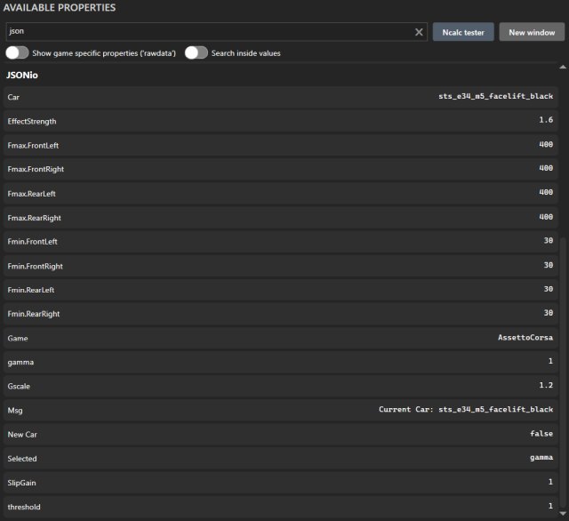
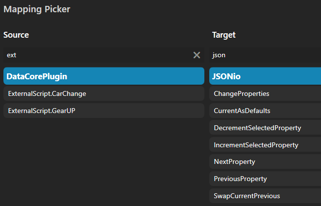
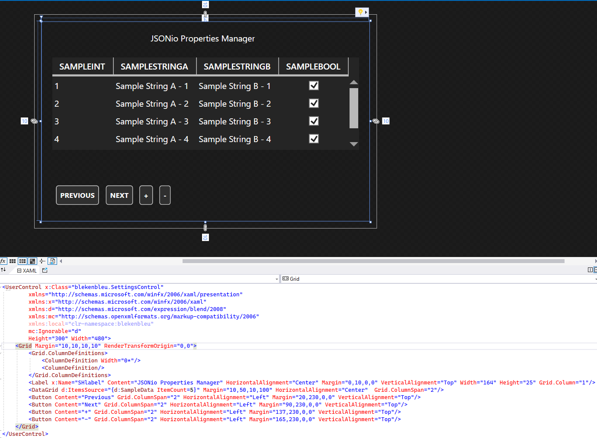

# SimHub JSONio plugin  
 from [SimHubPluginSdk](https://github.com/blekenbleu/SimHubPluginSdk/blob/main/README.md)  
## What
A common list of custom SimHub properties with values potentially specific to each sim and car.  
In this example, 4 properties are managed for ShakeIt Wheel Slip haptics:  

- a C# list of games
	- each game a name, game-specific default property values and list of cars
		- each car a carID and its list of property values
			- each property a name and value
- properties to be managed are configured in `JSONio.ini`.
## How
- instead of just copying that SimHubPluginSdk repository
	- Had Visual Studio create a new project, then quit
	- deleted everything in that project except `JSONio.sln` and `JSONio.csproj`
	- copied `Properties/` and source files from `SimHubPluginSdk/`
	- performed GVIM split diff on `JSONio.sln` and `JSONio.csproj`
		to preserve new `ProjectGuid`, etc
	- **forgot to** update namespace from `User.PluginSdk` to `JSONio` e.g. in `Properties/`...!
- `this.AddAction("ChangeProperties",(a, b) =>` saves current properties, if changed,  
	then loads properties for the new Car.
	- creates new Car object from game default if no CarID match
	- *could* implement `this.AddEvent("CarChange");`  
		in `public void Init(PluginManager pluginManager)`,  
		- then `this.TriggerEvent("CarChange");`  
			in `public void DataUpdate(PluginManager pluginManager, ref GameData data)`
	- *but instead* let SimHub do it, by `JSONio.ini`:
		```
		[ExportEvent]
		name='CarChange'
		trigger=changed(20, [DataCorePlugin.GameData.CarId]) 
		```
		- *my experience*:&nbsp; SimHub ignored this **Source** when `JSONio.ini` was first loaded...  
  

- in `Init()`, create a new Game object in games if none exists for current Game
	- set game from games

My understanding of C# is that `games` could be a jagged array,  
but jagged [List<>](https://learn.microsoft.com/en-us/dotnet/api/system.collections.generic.list-1) better supports
e.g. [adding and deleting elements](https://csharp-station.com/c-arrays-vs-lists/).

## New to me
- C# `List<>` and particularly with non-trivial objects.
	- [Here are some snippits](https://www.tutorialsteacher.com/csharp/csharp-list) with `List<Student>`
	- [*stackoverflow*:&nbsp; list search](https://stackoverflow.com/questions/1175645/find-an-item-in-a-list-by-linq)
	- [*M$ Learn*:&nbsp; List<T>.FindIndex Method](https://learn.microsoft.com/en-us/dotnet/api/system.collections.generic.list-1.findindex):&nbsp;
		[*index of item in a list*](https://stackoverflow.com/questions/17995706/how-can-i-get-the-index-of-an-item-in-a-list-in-a-single-step):  
		```
			int index = properties.FindIndex(a => a.Name == name);

			if (-1 == index)
				properties.Add ( new Property() { Name=name, Value=value });
			else if (replace && properties[index].Value != value)
				properties[index].Value = value;
		```
- C# JSON
	- In Visual Studio, [add `Newtonsoft.Json.NET` package](https://learn.microsoft.com/en-us/nuget/quickstart/install-and-use-a-package-in-visual-studio#add-the-newtonsoftjson-nuget-package)...  
	- pretty-print JSON from C#  AKA
		[serialize](https://learn.microsoft.com/en-us/dotnet/standard/serialization/system-text-json/how-to)  
		```
			using Newtonsoft.Json;

			if (games.Save_Car(current, gname) || changed)
			{
				string js = JsonConvert.SerializeObject(games.data, Formatting.Indented);
		```
	- Eventually, [Read and Parse a JSON File in C#](https://code-maze.com/csharp-read-and-process-json-file/) AKA
	 [deserialize](https://learn.microsoft.com/en-us/dotnet/standard/serialization/system-text-json/deserialization)  
		```
			if (File.Exists(path))  
			{  
				games = JsonSerializer.Deserialize<Games>(File.ReadAllText(path));  
			} else changed = true;  
		```
- C# [WPF DataGrid in XAML](https://blog.udemy.com/wpf-datagrid/) - [more references](Documentation/references)
	- 4 column table:
		- property name
		- default value
		- previous value
		- current value
	- XML header of row labels, as above
	- programatically add a row for each property configured
	- highlight current value of only selected property
	- first steps in Visual Studio:
		- click `Control.xaml`
		- select View->Designer
		- drag in `DataGrid` from `Common WPF Controls`
			- fiddle with margins for Grid and DataGrid to make space for Label
			- [add DataGrid column Headers](https://learn.microsoft.com/en-us/dotnet/desktop/wpf/controls/how-to-add-row-details-to-a-datagrid-control?view=netframeworkdesktop-4.8)
		- drag in buttons for previous, next, +, -, etc  
			
	- *3 April 2024*:  
		- [bind SimProp class to DataGrid columns](https://wpf-tutorial.com/datagrid-control/custom-columns/)
		```
			<DataGrid.Columns>
				<DataGridTextColumn Header="Property" Binding="{Binding Name}" />
				<DataGridTextColumn Header="Default" Binding="{Binding Default}" />
				<DataGridTextColumn Header="Current" Binding="{Binding Current}" />
				<DataGridTextColumn Header="Previous" Binding="{Binding Previous}" />
			</DataGrid.Columns>
		...
		public class SimProp
		{
			public string Name { get; set; }
			public string Default { get; set; }
			public string Current { get; set; }
			public string Previous { get; set; }
		}
		...
		public List<SimProp> simprops;

		public SettingsControl()
		{
			InitializeComponent();

			simprops = new List<SimProp>();
			dg.ItemsSource = simprops;
		}
		```
		- bind WPF button clicks directly to Plugin Action methods
	- *4 Apr*:
		- test buttons
		- populate `List<SimProp>` from existing `current`, `previous`, etc
	- *5 Apr*:
		- fully functional by buttons
			- Select hightlight forced for button changes, will not work for dashboard
		- `simprops` updated from original Lists, pending refactor
			- property updates by dashboard *should work*...
- C# WPF XY plot:&nbsp; SimHub already uses OxyPlot
	- using [OxyPlot](https://github.com/oxyplot/oxyplot)
		- [website](https://oxyplot.github.io/) &nbsp; [documentation](https://oxyplot.readthedocs.io/en/latest/)
		- [Bart De Meyer - Blog](https://blog.bartdemeyer.be/2013/03/creating-graphs-in-wpf-using-oxyplot/)
		- [CodeProject](https://www.codeproject.com/Articles/1164395/Wpf-application-with-real-time-data-in-OxyPlot-cha)
		- [stackoverflow example](https://stackoverflow.com/questions/44697701/create-an-oxyplot-in-wpf)
