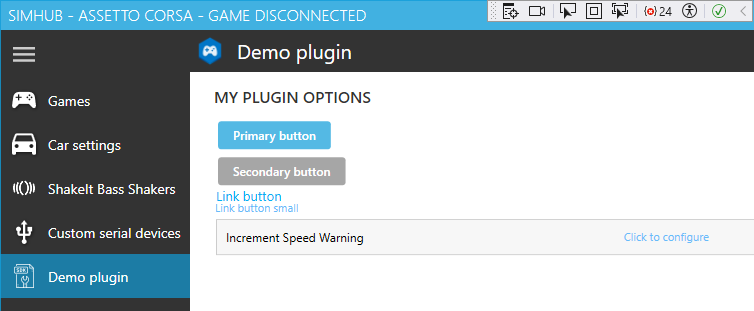

# SimHubPluginSdk
 More portable plugin SDK demo from [SimHub 9.1.12](https://www.simhubdash.com/download-2/):  
- 2 sections in `SimHubPluginSdk.csproj` that help debug:
    - Visual Studio builds install dll in SimHub folder:  
        `<OutputPath>..\..\</OutputPath>`
    - [Visual Studio debug launches SimHub](https://learn.microsoft.com/en-us/dotnet/api/system.environment.processpath):
```
    <PropertyGroup Condition="'$(Configuration)|$(Platform)' == 'Debug|AnyCPU'">
      <StartAction>Program</StartAction>
      <StartProgram>..\..\SimHubWPF.exe</StartProgram>
    </PropertyGroup>
``` 
- if installed as `SimHub\PluginSdk\SimHubPluginSdk\`, then Visual Studio `Build` and `Debug` *just work*  
## XAML user interface:&nbsp; [Create a UI by using XAML Designer](https://learn.microsoft.com/en-us/visualstudio/xaml-tools/creating-a-ui-by-using-xaml-designer-in-visual-studio?view=vs-2022)  
Until now, [my **SimHub plugins**](https://blekenbleu.github.io/static/SimHub/) avoided having any user interface:  
- @Romainrob *20 Jan 2023* "remove `IWPFSettingsV2` from the class declaration"  

### SimHub user interface uses [XAML](https://learn.microsoft.com/en-us/visualstudio/xaml-tools/?view=vs-2022)  
- @MorGuux *18 Jul 2018*:&nbsp; It uses WPF for the visual framework, so you can use anything WPF, not forms  
- when Visual Studio is first launched for this project, the **SettingsControl.xaml** tab will show:  
	  
	... which displays in SimHub as:  
	  
- @Wotever *12 Aug 2018*:&nbsp; "Designer really miss of precision, it's way better to use the xaml editor.  
	 	- 	With designer you barely can't do scalable ui"  
- [MahApps.Metro documentation](https://mahapps.com/)  
- @RaceX *20 Nov 2022*:&nbsp; you can use the xaml hot reload feature while debugging  
- removed `Demo` from file names and used VIM to:  
	- remove 'Demo' from references 
	- replace `My.PluginSdk` with `SimHubPluginSdk`  

<details><summary>click for details</summary>
<pre>
bleke@Antec MSYS /d/my/SimHub/PluginSdk/SimHubPluginSdk
$ ls | grep Demo
DataPluginDemo.cs
DataPluginDemoSettings.cs
SettingsControlDemo.xaml
SettingsControlDemo.xaml.cs

bleke@Antec MSYS /d/my/SimHub/PluginSdk/SimHubPluginSdk
$ git mv DataPluginDemo.cs DataPlugin.cs

bleke@Antec MSYS /d/my/SimHub/PluginSdk/SimHubPluginSdk
$ git mv DataPluginDemoSettings.cs DataPluginSettings.cs

bleke@Antec MSYS /d/my/SimHub/PluginSdk/SimHubPluginSdk
$ git mv SettingsControlDemo.xaml SettingsControl.xaml

bleke@Antec MSYS /d/my/SimHub/PluginSdk/SimHubPluginSdk
$ git mv SettingsControlDemo.xaml.cs SettingsControl.xaml.cs
</pre>
</details>

