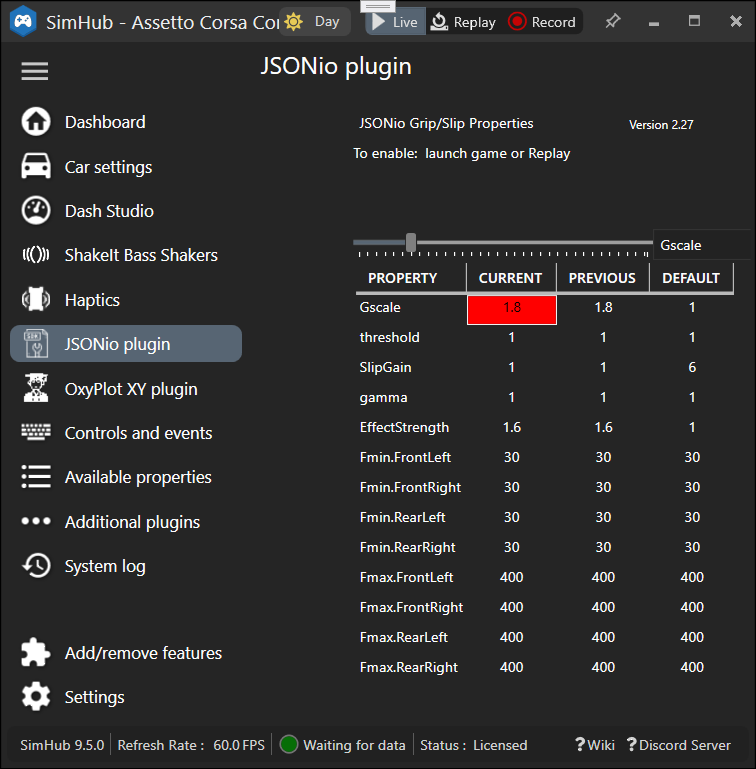
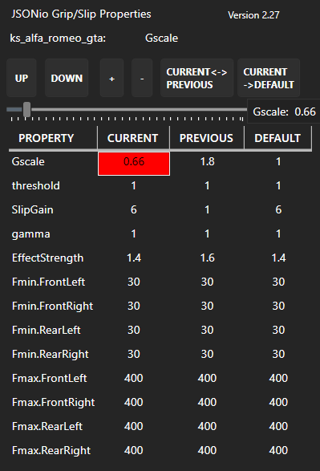

# SimHub JSONio plugin  
 from [SimHubPluginSdk](https://github.com/blekenbleu/SimHubPluginSdk/blob/main/README.md)  
- **switch to [SlipGrip branch](https://github.com/blekenbleu/JSONio/tree/SlipGrip) for Custom ShakeIt effects implemented in C#**
## What
 &nbsp;   
A common list of custom SimHub properties with *some* values potentially specific to each sim and car.  
In this example, properties are managed for ShakeIt Wheel Slip haptics:  

- a C# list of games
	- each `Game` object a `name`, game-specific `defaults Property List<>` and `CList` of `Car` objects
		- each `Car` object a `carID` and its `List<>` of `Property` objects
			- each `Property` object a `Name` and `Value` 
- Properties to be managed are configured in [`JSONio.ini`](NCalcScripts/JSONio.ini).
## How
- instead of just copying that SimHubPluginSdk repository
	- created a new Visual Studio JSONio WPF project, then quit
	- deleted everything in that project except `JSONio.sln` and `JSONio.csproj`
	- copied `Properties/` and source files from `SimHubPluginSdk/`
	- performed GVIM split diff on `JSONio.sln` and `JSONio.csproj`
		to preserve new `ProjectGuid`, etc
	- **forgot to** update namespace from `User.PluginSdk` to `JSONio` e.g. in `Properties/`...!
	- **easily missed** namespace in `.xaml` called `xmlns:local="clr-namespace:..."`  
- `this.AddAction("ChangeProperties",(a, b) =>` saves changed `Car properties` list,  
	then loads `properties` matching changed `Car.ID` and `Game gname`.
	- updates `Values` list from `defaults` for `Game gname` if no `Car.ID` match
	- *could* implement `this.AddEvent("CarChange");`  
		in `public void Init(PluginManager pluginManager)`,  
		- then `this.TriggerEvent("CarChange");`  
			in `public void DataUpdate(PluginManager pluginManager, ref GameData data)`
	- *but instead* let SimHub do it, by `JSONio.ini`:
		```
		[ExportEvent]
		name='CarChange'
		trigger=changed(20, [DataCorePlugin.GameData.CarId]) 
		```

  
		- *my experience*:&nbsp; SimHub ignored this **Source** when `JSONio.ini` was first loaded...  

- in `JSONio.cs Init()`
	- create `games` object
		- populate from configured `.json` file, if existing
	- populate `simValues` object from saved `Settings`, `games` and `JASONio.ini`
	- in `this.AddAction("ChangeProperties",(a, b)`
		- create new `Game` object in `games` when none match current `Game name`
		- set `game` for matching `games.data.name`
	- additional `this.AddAction()`s for modifying `Car` and `defaults` values

My understanding of C# is that `games` could be a jagged array,  
but jagged [List<>](https://learn.microsoft.com/en-us/dotnet/api/system.collections.generic.list-1) better supports
e.g. [adding and deleting elements](https://csharp-station.com/c-arrays-vs-lists/), based on `JSONio.ini`.

### To Do &nbsp; *24 Apr 2024*  
- **done** stop mouse click messing with selected property in UI
- **done** property indicating a new car
- **done** manage some SimHub properties *not-per car*, e.g. ShakeIt frequency limits
	- some tricks:
		- conversion to/from Car class has uses only first pCount `List<Values>`,  
		which GameHandler class uses to save cars into `Games data` for `.json` file.
		- JSONio knows about properties beyond pCount in `List<Values> simValues`...
			- these are NOT saved in `.json` files
			- these ARE available as SimHub properties e.g. for ShakeIt
			- these ARE available for value changes in user interface  
	- refactored to use *only* `List<Values> simValues` for user interface;
		- using `JSONio.ini`, convert from/to `DataPluginSettings Settings` in `Init()`/`End()`
		- restore/save simValue.Current values from/to `GameHandler games.Car` from/to `JSONio.json`
- **done** *slim* .json format storing only one instance of property names, instead of redundantly per-car

### To Do &nbsp; *5 Feb 2025 V1.24*
- **done:** generate release .zip file for Release 1.25 and newer builds
	- in `JSONio.csproj`:
```
  <PropertyGroup>
    <PostBuildEvent>
      cd "$(ProjectDir)"
      if $(ConfigurationName) == Release (7z u R:\TEMP\JSONio.zip NCalcScripts\JSONio.ini)
      cd "bin\Release"
      if $(ConfigurationName) == Release (7z u R:\TEMP\JSONio.zip JSONio.dll)
    </PostBuildEvent>
  </PropertyGroup>
```
	- removed obsolete `Documentation\release.sh`  
- fix SimHub crashes for `OOps()` popups
	- moving `OOpsMB()` to `Control.xaml.cs` did not help  
- fix bugs for `JSONio.file` property *not* 'PluginsData/JSONio.json'
- save global properties and all property names to `Settings`
- add distinct `JSONio.ini` configuration for per-game properties:
	- global
	- per game
	- per car
- [OxyScope](https://github.com/blekenbleu/OxyPlotPlugin) integration

## New to me
- C# `List<>` patterns, particularly with non-trivial objects.
	- [Here are some snippits](https://www.tutorialsteacher.com/csharp/csharp-list) with `List<Student>`
	- [*stackoverflow*:&nbsp; list search](https://stackoverflow.com/questions/1175645/find-an-item-in-a-list-by-linq)
	- [*M$ Learn*:&nbsp; List<T>.FindIndex Method](https://learn.microsoft.com/en-us/dotnet/api/system.collections.generic.list-1.findindex):&nbsp;
		[*index of item in a list*](https://stackoverflow.com/questions/17995706/how-can-i-get-the-index-of-an-item-in-a-list-in-a-single-step):  
		```
			int index = properties.FindIndex(a => a.Name == name);

			if (-1 == index)
				properties.Add ( new Property() { Name=name, Value=value });
			else if (replace && properties[index].Value != value)
				properties[index].Value = value;
		```
- C# JSON
	- In Visual Studio, [add `Newtonsoft.Json.NET` package](https://learn.microsoft.com/en-us/nuget/quickstart/install-and-use-a-package-in-visual-studio#add-the-newtonsoftjson-nuget-package)...  
	- pretty-print JSON from C#  AKA
		[serialize](https://learn.microsoft.com/en-us/dotnet/standard/serialization/system-text-json/how-to)  
		```
			using Newtonsoft.Json;

			if (games.Save_Car(current, gname) || changed)
			{
				string js = JsonConvert.SerializeObject(games.data, Formatting.Indented);
		```
	- Eventually, [Read and Parse a JSON File in C#](https://code-maze.com/csharp-read-and-process-json-file/) AKA
	 [deserialize](https://learn.microsoft.com/en-us/dotnet/standard/serialization/system-text-json/deserialization)  
		```
			if (File.Exists(path))  
			{  
				games = JsonSerializer.Deserialize<Games>(File.ReadAllText(path));  
			} else changed = true;  
		```
- C# [WPF DataGrid in XAML](https://blog.udemy.com/wpf-datagrid/)&nbsp; -&nbsp;
	[more references](Documentation/index.md)  
	- 4 column table:
		- property name
		- default value
		- previous value
		- current value
	- XML header of row labels, as above
	- programatically add a row for each property configured
	- highlight current value of only selected property
	- first steps in Visual Studio:
		- click `Control.xaml`
		- select View->Designer
		- drag in `DataGrid` from `Common WPF Controls`
			- fiddle with margins for Grid and DataGrid to make space for Label
			- [add DataGrid column Headers](https://learn.microsoft.com/en-us/dotnet/desktop/wpf/controls/how-to-add-row-details-to-a-datagrid-control?view=netframeworkdesktop-4.8)
		- drag in buttons for previous, next, +, -, etc  
- C# [Dispatcher.Invoke()](https://learn.microsoft.com/en-us/dotnet/api/system.windows.threading.dispatcher.invoke?view=windowsdesktop-8.0#system-windows-threading-dispatcher-invoke(system-action))
	- WPF DataGrid user interface updates want a [method](https://github.com/blekenbleu/JSONio/blob/a1fc9f75966f2fffc43bfcaa66c4cfff117e1d40/Control.xaml.cs#L38).
	- Invoking method on WPF DataGrid resources is disallowed from other threads.
	- [`Dispatcher.Invoke()`](https://dotnetpattern.com/wpf-dispatcher) is
	[*less code*](https://github.com/blekenbleu/JSONio/blob/a1fc9f75966f2fffc43bfcaa66c4cfff117e1d40/StaticModel.cs#L58)
	than subscribing to `PropertyChanged` events
### Updates
- *3 April 2024*:  
		- [bind Values class to DataGrid columns](https://wpf-tutorial.com/datagrid-control/custom-columns/)
```
			<DataGrid.Columns>
				<DataGridTextColumn Header="Property" Binding="{Binding Name}" />
				<DataGridTextColumn Header="Default" Binding="{Binding Default}" />
				<DataGridTextColumn Header="Current" Binding="{Binding Current}" />
				<DataGridTextColumn Header="Previous" Binding="{Binding Previous}" />
			</DataGrid.Columns>
		...
		public class Values
		{
			public string Name { get; set; }
			public string Default { get; set; }
			public string Current { get; set; }
			public string Previous { get; set; }
		}
		...
		public List<Values> simValues;

		public SettingsControl()
		{
			InitializeComponent();

			simValues = new List<Values>();
			dg.ItemsSource = simValues;
		}
```
	- bind WPF button clicks directly to Plugin Action methods
- *4 Apr*:
		- test buttons  
		- populate `List<Values>` from existing `current`, `previous`, etc
- *5 Apr*:
		- fully functional by buttons  
			- Select hightlight forced for button changes, will not work for dashboard  
		- `simValues` updated from original Lists, pending refactor  
			- property updates by dashboard *should work*...
- *7 Apr*:
		- fully functional by buttons *and* dashboard  
			- thanks to arguably sketch code rearranging...  
			- still to do:&nbsp; fully integrate `simValues` in `JSONio.cs`
- [**C# WPF XY plot**](https://github.com/blekenbleu/OxyPlotPlugin):&nbsp; SimHub already uses OxyPlot
	- using [OxyPlot](https://github.com/oxyplot/oxyplot)
		- [website](https://oxyplot.github.io/) &nbsp; [documentation](https://oxyplot.readthedocs.io/en/latest/)
		- [Bart De Meyer - Blog](https://blog.bartdemeyer.be/2013/03/creating-graphs-in-wpf-using-oxyplot/)
		- [CodeProject](https://www.codeproject.com/Articles/1164395/Wpf-application-with-real-time-data-in-OxyPlot-cha)
		- [stackoverflow example](https://stackoverflow.com/questions/44697701/create-an-oxyplot-in-wpf)

- *12 May 2024* - **MessageBox**
	- SimHub Event triggers do not work from plugin `Init()`
	- `MessageBox()` during `Init()` (e.g. for `JASONio.ini` configuration errors)  
		provokes extensive SimHub log error message.
	- for game runtime, added "JSONioOOps" `TriggerEvent` and  
		`this.AddAction("OopsMessageBox", (a, b) => OOpsMB());`

- *12 Oct* - sync most code to [SlipGrip branch](https://github.com/blekenbleu/JSONio/tree/SlipGrip)
### *13 Oct* - **configurable slider**  
- instead of hard-coded to `Gscale`
- configured in [`NCalcScripts/JSONio.ini`](NCalcScripts/JSONio.ini),   
	where `value` may be any name in `JSONio.properties`, e.g.:
```
[ExportProperty]
name='JSONio.slider'
value='Gscale' 
```
