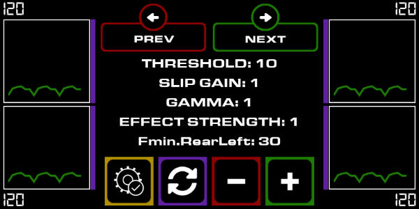

# SimHub JSONio plugin:&nbsp; *SlipGrip branch*  
 from [SimHubPluginSdk](https://github.com/blekenbleu/SimHubPluginSdk/blob/main/README.md)  
- *switch to* [master branch](https://github.com/blekenbleu/JSONio) for generic configurable per-car properties  
## What:&nbsp; ShakeIt CUSTOM wheel grip/slip effects *implemented in* `C#`  
- using [*this* **ShakeIt** `profile`](https://github.com/blekenbleu/SimHub-Profiles/blob/main/Any%20Game%20-%20JSONioNewSlipGrip.siprofile)
  and (optionally) [*this* dashboard](https://github.com/blekenbleu/SimHub-Profiles/blob/main/JSONio%20dash%205.31.simhubdash)  
  
- **EffectStrength** controls `SlipGrip` amplitude
- **SlipGain** and **gamma** control `ProxyS` slip
- **threshold** affects `LoadedSlipGrip` values
- **Gscale** affects `Grip` values
  

 &emsp; &emsp; &emsp; *car launched*:  
 &emsp; &emsp;   

Custom SimHub **ShakeIt** Wheel grip / slip settings with *some* car-specific properties.  

- Properties and settings are configured in [`JSONio.ini`](NCalcScripts/JSONio.ini).
## How
- notify plugin of car changes by `JSONio.ini`:  
```
		[ExportEvent]
		name='CarChange'
		trigger=changed(20, [DataCorePlugin.GameData.CarId]) 
```

  

- in `JSONio.cs Init()`
	- `this.AddAction()`s for modifying `Car` and `defaults` values

## SlipGrip - *28 Sep - 2 Oct 2024*
- Port ShakeIt CUSTOM EFFECTS JavaScript to C#
	- better performance, easier to maintain
	- Version 2.0: add version TextBlock
	- Version 2.1: added ShakeIt.cs with first JavaScript approximations
	- Version 2.2: JSONio.ini comment strings; ShakeIt.cs random, Grip, Raw, FF, LoadedSlipGrip
	- Version 2.3: GameName-dependent slipGrip; debug ACslipGrip()
    - Version 2.4: Mostly coded; SlipGrip output amplitudes nearly match, but FF do not;  
		suspect high/low indexing...  Temporarily forced `random[0-3]` constant for debugging.
	- Version 2.5: [**Dash**](https://github.com/blekenbleu/SimHub-Profiles/blob/main/JSONio%20dash%205.31.simhubdash)  
		  
		- `green` tire plots are slips; &nbsp; `red` plots are Slip/Grip
		- `purple bars` are ShakeIt effect output amplitudes; &nbsp; `numbers` are haptic frequencies
		-  = use current settings as game defaults
		-  = swap current settings with those of previous car (reversible)  


- *11 Oct* - Version 2.18: enable **PREV** and **NEXT** from iPhone  
		[`Dispatcher.Invoke(() => Ctrl.Selected())`](https://www.webdevtutor.net/blog/c-sharp-wpf-update-ui-from-another-thread) // update DataGrid from another thread
- *12 Oct* - sync most code to [master branch](https://github.com/blekenbleu/JSONio/)
### *13 Oct* - **configurable slider**  
- instead of hard-coded to `Gscale`
- configured in [`NCalcScripts/JSONio.ini`](NCalcScripts/JSONio.ini),   
	where `value` may be any name in `JSONio.properties`, e.g.:
```
[ExportProperty]
name='JSONio.slider'
value='Gscale' 
```

### *18 Feb 2025* ported master branch changes
- cumulative Init message display
- Help link and changed indicator
- slider property assignment button
- change and save only Selected Default, but save all Current per-car changes
- bug fix: SaveCar() now explicitly saves per-car and per-game changes for existing cars
- bug fix: preserve saved settings *only for first instance* of previous game car

